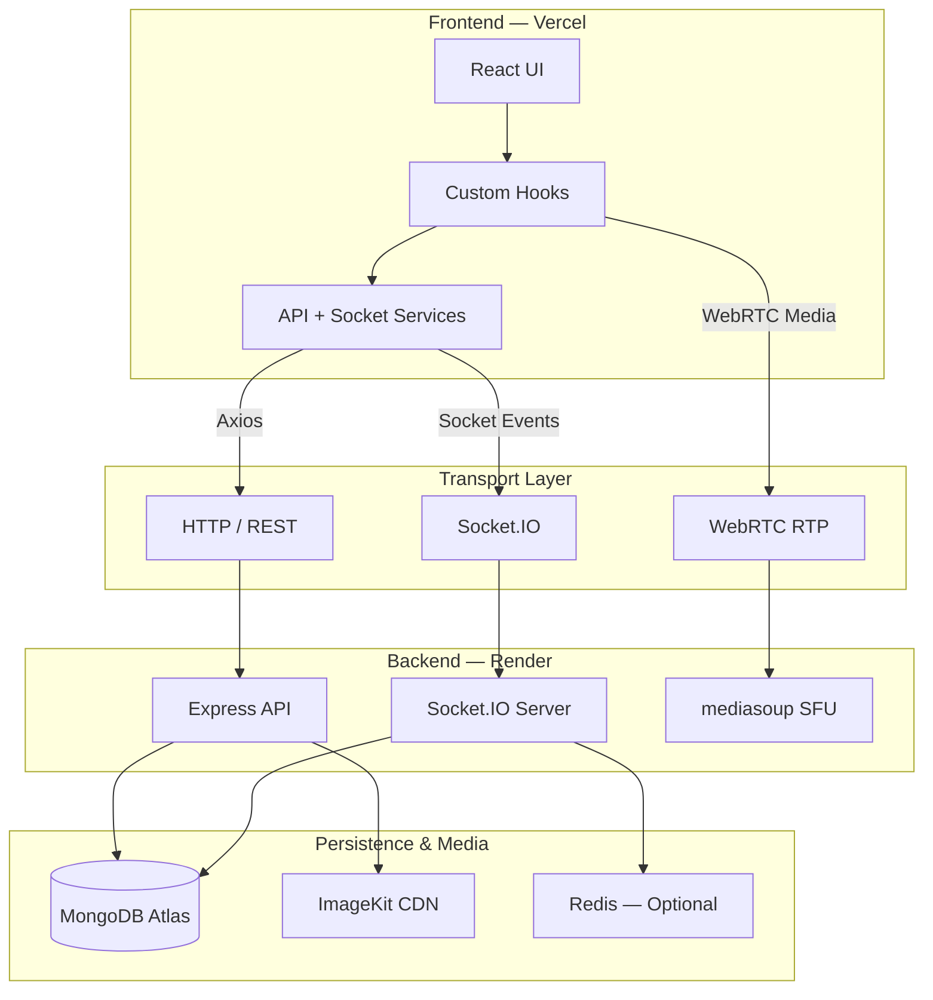

# chatSocial

> **A real-time social communication platform built for modern web messaging, stories, presence, and WebRTC calling.**

chatSocial is a full-stack communication platform that combines **real-time messaging, user connections, group conversations, 24-hour stories, online presence, media sharing, and audio/video calling** in a single application.

The project uses a layered architecture across a React/TypeScript frontend, an Express/Node.js backend, MongoDB Atlas for persistence, Socket.IO for real-time events, ImageKit for media delivery, and mediasoup as the WebRTC Selective Forwarding Unit (SFU).

---

## ✦ Product Overview

chatSocial is designed around a simple principle:

**REST handles durable application state. Real-time transports handle immediacy. WebRTC handles media.**

That separation gives the application a clean division of responsibility:

```text
                           ┌──────────────────────┐
                           │      chatSocial      │
                           └──────────┬───────────┘
                                      │
                  ┌───────────────────┼───────────────────┐
                  │                   │                   │
                  ▼                   ▼                   ▼
            REST / HTTP          Socket.IO             WebRTC
          Durable state        Live application      Live media
                  │              events/presence          │
                  │                   │                   │
                  ▼                   ▼                   ▼
              Express             Socket.IO           Mediasoup
                  │                Server/SFUs           │
          ┌───────┴────────┐                              │
          ▼                ▼                              ▼
     MongoDB Atlas      ImageKit                    Audio / Video
```

---

# Table of Contents

- [Product Overview](#-product-overview)
- [Core Capabilities](#-core-capabilities)
- [Technology Stack](#-technology-stack)
- [Architecture](#-architecture)
- [Repository Structure](#-repository-structure)
- [Application Data Flow](#-application-data-flow)
  - [Authentication](#1-authentication--session-persistence)
  - [Real-Time Messaging](#2-real-time-messaging)
  - [User Discovery & Connections](#3-user-discovery--connections)
  - [Stories & Status](#4-stories--status)
  - [Voice & Video Calling](#5-voice--video-calling)
- [Database Model](#-database-model)
- [Frontend Architecture](#-frontend-architecture)
- [Backend Architecture](#-backend-architecture)
- [Real-Time Architecture](#-real-time-architecture)
- [Media & Upload Pipeline](#-media--upload-pipeline)
- [Security Model](#-security-model)
- [Deployment](#-deployment)
- [Environment Configuration](#-environment-configuration)
- [Operational Notes](#-operational-notes)
- [Project Status](#-project-status)

---

# ✦ Core Capabilities

### 💬 Real-Time Messaging
- One-to-one and group conversations
- Socket.IO-powered message delivery
- Optimistic UI updates
- Message edit and delete flows
- Typing indicators
- Attachment-aware messages
- Offline REST fallback
- Local message caching

### 👥 Social Connections
- User discovery and search
- Connection requests
- Incoming and outgoing request states
- Accept/reject workflows
- Automatic direct-room creation after acceptance

### 🟢 Presence
- Live online/offline tracking
- Socket-authenticated sessions
- User-to-socket mapping
- Real-time presence broadcasts

### 🕐 24-Hour Stories
- Text statuses
- Photo/video statuses
- Custom text background colors
- Viewer tracking
- Automatic expiry through a 24-hour TTL index
- Story replies converted into chat messages

### 📞 Audio & Video Calling
- One-to-one calling
- Group-call capable session architecture
- Audio/video device access through browser APIs
- WebRTC RTP media transport
- mediasoup SFU routing
- Socket.IO signaling

### 🖼️ Media
- User avatars
- Group images
- Chat attachments
- Photo/video/document uploads
- ImageKit-backed media delivery

---

# ✦ Technology Stack

## Frontend

| Technology | Version | Responsibility |
|---|---:|---|
| React | `19.2.7` | Component-based UI |
| React DOM | `19.2.7` | Browser rendering |
| Vite | `8.1.1` | Development server and build pipeline |
| TypeScript | `5.9.3` | Static typing |
| React Router | `8.3.0` | SPA routing |
| Tailwind CSS | `4.3.3` | Utility-first styling |
| Framer Motion | `13.1.1` | UI animation and transitions |
| Three.js | `0.185.1` | Interactive 3D/WebGL landing experience |
| Canvas Confetti | `1.9.4` | Celebration effects |
| Lucide React | `1.33.0` | Icon system |
| Radix UI | `^2.1.15 / ^1.3.3` | Accessible UI primitives |
| CVA | `0.7.1` | Component variants |
| clsx | `2.1.1` | Conditional class composition |
| tailwind-merge | `3.6.0` | Tailwind class conflict resolution |
| tw-animate-css | `1.4.0` | CSS animation utilities |

## Real-Time & Calling

| Technology | Version | Responsibility |
|---|---:|---|
| Socket.IO | `4.8.3` | Real-time events, messaging, presence, signaling |
| mediasoup-client | `3.23.1` | Browser-side WebRTC/SFU integration |
| mediasoup | `3.26.0` | Server-side SFU media routing |

## Backend

| Technology | Version | Responsibility |
|---|---:|---|
| Node.js | `>=18.0.0` | Server runtime |
| Express.js | `5.2.1` | REST API framework |
| Axios | `1.19.0` | HTTP client and API interceptors |

## Persistence & Storage

| Technology | Version | Responsibility |
|---|---:|---|
| MongoDB Atlas | Cloud | Primary application database |
| Mongoose | `9.9.3` | ODM, schemas, validation, indexes |
| Redis | `6.2.1` | Optional in-memory store for caching/scaling |
| ImageKit Node SDK | `7.11.0` | Media upload and CDN integration |
| Multer | `2.3.0` | Multipart/in-memory upload parsing |

## Security & Validation

| Technology | Version | Responsibility |
|---|---:|---|
| JSON Web Token | `9.0.3` | Signed authentication tokens |
| Bcrypt | `6.0.0` | Password hashing |
| Cookie Parser | `1.4.7` | Cookie parsing |
| CORS | `2.8.6` | Cross-origin request policy |
| Express Validator | `7.3.2` | Request validation/sanitization |

## Tooling & Deployment

| Technology | Responsibility |
|---|---|
| ESLint 10 | Linting and code quality |
| Nodemon | Backend development reloads |
| Dotenv | Environment configuration |
| Vercel | Frontend hosting |
| Render | Backend hosting |
| MongoDB Atlas | Managed database |
| ImageKit | Media storage/CDN |

---

# ✦ Architecture

## System Architecture



### Architectural Responsibilities

| Layer | Responsibility |
|---|---|
| React UI | Presentation and user interaction |
| Custom Hooks | Feature state, lifecycle, synchronization |
| API Services | REST communication |
| Socket Service | Persistent real-time connection and event dispatch |
| Express | Authentication, REST routing, validation and request handling |
| Services | Business logic and persistence operations |
| Socket Handlers | Real-time messaging, presence, rooms and call signaling |
| MongoDB | Durable application state |
| ImageKit | Media storage and CDN delivery |
| mediasoup | WebRTC SFU routing |
| Redis | Optional caching/distributed state support |

---

# ✦ Repository Structure

```text
chatSocial/
│
├── backend/
│   ├── server.js
│   │
│   └── src/
│       ├── app.js
│       │
│       ├── config/
│       │   ├── connectDB.js
│       │   └── mediasoup.config.js
│       │
│       ├── controller/
│       │   ├── auth.controller.js
│       │   ├── user.controller.js
│       │   ├── room.controller.js
│       │   ├── message.controller.js
│       │   ├── status.controller.js
│       │   └── call.controller.js
│       │
│       ├── middleware/
│       │   ├── auth.middleware.js
│       │   ├── upload.middleware.js
│       │   └── error.middleware.js
│       │
│       ├── model/
│       │   ├── user.model.js
│       │   ├── room.model.js
│       │   ├── message.model.js
│       │   ├── status.model.js
│       │   └── call.model.js
│       │
│       ├── routes/
│       │   ├── auth.routes.js
│       │   ├── user.routes.js
│       │   ├── room.routes.js
│       │   ├── message.route.js
│       │   ├── status.routes.js
│       │   └── call.routes.js
│       │
│       ├── service/
│       │   ├── imagekit.service.js
│       │   ├── message.service.js
│       │   ├── room.service.js
│       │   ├── status.service.js
│       │   └── callLog.service.js
│       │
│       └── sockets/
│           ├── index.js
│           │
│           ├── handlers/
│           │   ├── message.handlers.js
│           │   ├── room.handlers.js
│           │   ├── present.handler.js
│           │   └── call.handlers.js
│           │
│           └── service/
│               ├── presence.service.js
│               ├── mediasoupWorker.js
│               ├── media.service.js
│               └── callSession.manager.js
│
├── frontend/
│   ├── index.html
│   │
│   └── src/
│       ├── main.jsx
│       ├── App.jsx
│       │
│       ├── features/
│       │   ├── auth/
│       │   │   ├── UI/
│       │   │   ├── api/
│       │   │   └── hooks/
│       │   │
│       │   ├── chat/
│       │   │   ├── UI/
│       │   │   ├── api/
│       │   │   └── hooks/
│       │   │
│       │   └── landing/
│       │       └── UI/
│       │
│       ├── components/
│       │   └── ui/
│       │
│       └── lib/
│           └── utils.ts
│
├── frontend/vercel.json
├── render.yaml
└── README.md
```

---

# ✦ Application Data Flow

## 1. Authentication & Session Persistence

```text
SignUp / SignIn UI
        │
        ▼
authService.ts
        │
        ▼
POST /api/auth/login
        │
        ▼
Express Controller
        │
        ├──► Bcrypt password verification
        │
        ▼
JWT generation
        │
        ├──► HTTP-only cookie
        │
        └──► Token returned to client
                     │
                     ▼
               Axios / Socket
                     │
                     ▼
            Authenticated session
```

The documented authentication flow uses:

- Bcrypt for password verification
- Signed JWT authentication
- HTTP-only cookie support
- Bearer-token authentication for API calls
- JWT authentication during Socket.IO connection
- Frontend token persistence through `localStorage`

> **Security note:** production credentials and secrets are intentionally not included in this repository documentation. Store them through deployment environment variables.

---

## 2. Real-Time Messaging

The messaging pipeline uses **Socket.IO for immediate delivery** and **MongoDB for durable storage**.

```text
User
 │
 ▼
ChatArea.tsx
 │
 ▼
useChat.ts
 │
 ├──► Optimistic UI message
 │
 └──► socketService.sendMessage(...)
              │
              ▼
       Socket.IO Server
              │
              ▼
     message.handlers.js
              │
              ▼
     messageService.createMessage()
              │
              ▼
        MongoDB
              │
              ▼
      Saved message
              │
              ▼
 io.to(roomId).emit(...)
              │
        ┌─────┴─────┐
        ▼           ▼
     Sender      Receiver
```

### Optimistic Reconciliation

The frontend first renders a temporary message ID so the sender sees the message immediately.

Once the server persists the message, the real MongoDB document replaces the temporary local message.

```text
Temporary ID
   ↓
UI renders instantly
   ↓
Server persists message
   ↓
MongoDB _id returned
   ↓
Temporary record reconciled
```

### Offline / Socket Failure Fallback

When real-time delivery is unavailable, the documented client flow can fall back to the HTTP message API.

```text
Socket available?
     │
 ┌───┴───┐
 │       │
Yes      No
 │       │
 ▼       ▼
Socket   REST
.IO      API
```

This keeps durable message creation independent from the live event transport.

---

## 3. User Discovery & Connections

The connection system models four relationship states:

```text
             User Search
                  │
        ┌─────────┼─────────┐
        ▼         ▼         ▼
    connected   pending    none
                 │
          ┌──────┴──────┐
          ▼             ▼
   pending_incoming  pending_sent
```

### Connection Lifecycle

```text
Search User
    │
    ▼
GET /api/users/search
    │
    ▼
Relationship State
    │
    ├── connected
    ├── pending_incoming
    ├── pending_sent
    └── none
    │
    ▼
Connect / Accept / Decline
    │
    ▼
Backend updates both users
    │
    ▼
Direct room created on acceptance
    │
    ▼
Socket.IO connection:accepted
    │
    ▼
Clients refresh immediately
```

---

## 4. Stories & Status

Stories are persisted in MongoDB and backed by ImageKit for media.

```text
Status UI
   │
   ├── Text
   │
   └── Media
        │
        ▼
      Multer
        │
        ▼
   ImageKit upload
        │
        ▼
   Media URL
        │
        ▼
  Status document
        │
        ▼
MongoDB + 24h TTL
```

### Story Viewing

```text
Status Tray
    │
    ▼
StoryViewerModal
    │
    ├── progress timer
    ├── automatic advance
    └── viewer tracking
```

### Story Replies

A reply can become a dedicated `story-reply` message containing story context, allowing the status interaction to transition naturally into a direct conversation.

---

## 5. Voice & Video Calling

The calling architecture separates **signaling** from **media transport**.

```text
Caller
  │
  ▼
useCalls.ts
  │
  ▼
Socket.IO signaling
  │
  ▼
Receiver
  │
  └──── Accept
          │
          ▼
navigator.mediaDevices.getUserMedia()
          │
          ▼
mediasoup-client
          │
          ▼
WebRTC Transport
          │
          ▼
mediasoup SFU
          │
          ▼
 RTP forwarding
          │
          ▼
 Other participant(s)
```

### Calling Components

| Component | Responsibility |
|---|---|
| `useCalls.ts` | Frontend call lifecycle |
| `call.handlers.js` | Signaling and call events |
| `callSession.manager.js` | Active call session state |
| `media.service.js` | WebRTC transport/media operations |
| `mediasoupWorker.js` | SFU worker pool |
| `mediasoup.config.js` | Worker/router/WebRTC configuration |
| `mediasoup-client` | Browser-side media producer/consumer |
| mediasoup | Server-side SFU |

### Why an SFU?

The documented implementation uses a **Selective Forwarding Unit** rather than making every participant establish a direct media connection with every other participant.

Conceptually:

```text
Without SFU:

A ───────── B
│ ╲       ╱ │
│   ╲   ╱   │
│     ╳     │
│   ╱   ╲   │
C ───────── D


With SFU:

A ──┐
B ──┼──► SFU ──► Participants
C ──┤
D ──┘
```

The SFU receives RTP streams and forwards appropriate streams to other participants.

---

# ✦ Database Model

MongoDB Atlas is the primary durable store.

## `users`

Stores identity, authentication and connection-network information.

```text
users
├── name
├── username
├── email
├── password
├── avatar
├── contacts[]
├── connectionRequests[]
└── sentRequests[]
```

## `rooms`

Represents direct and group conversations.

```text
rooms
├── roomname
├── description
├── isDirect
├── createdBy
├── members[]
└── avatar
```

## `messages`

Stores chat content and metadata.

```text
messages
├── roomId
├── userId
├── text
├── type
├── meta
└── deleted
```

Supported message types documented by the project include:

- `text`
- `photo`
- `audio`
- `document`
- `story-reply`

## `statuses`

Stores 24-hour status updates.

```text
statuses
├── userId
├── content
├── mediaType
├── mediaUrl
├── backgroundColor
├── viewers[]
└── createdAt
```

A TTL index handles automatic status expiry after 24 hours.

## `calls`

Stores call history and lifecycle metadata.

```text
calls
├── callerId
├── receiverId
├── callType
├── status
├── duration
├── startedAt
└── endedAt
```

---

# ✦ Frontend Architecture

The frontend is organized around **feature boundaries** rather than one large component tree.

```text
features/
├── auth/
│   ├── UI
│   ├── api
│   └── hooks
│
├── chat/
│   ├── UI
│   ├── api
│   └── hooks
│
└── landing/
    └── UI
```

## Core Chat UI

The documented chat surface includes:

| Component | Responsibility |
|---|---|
| `Home.tsx` | Main application layout |
| `SidebarRail.tsx` | Primary navigation |
| `ChatList.tsx` | Conversation list |
| `ChatArea.tsx` | Active conversation |
| `GroupsSection.tsx` | Group creation and management |
| `StatusSection.tsx` | Story/status tray |
| `StoryViewerModal.tsx` | Story playback |
| `CallsSection.tsx` | Call history/interface |
| `CallModal.tsx` | Incoming/outgoing call UI |
| `NewChatModal.tsx` | User discovery and connections |
| `EditProfileModal.tsx` | Profile customization |

## State & Feature Hooks

### `useChat`
Central chat engine responsible for:

- Chats
- Messages
- Active chat
- Unread counts
- Connection requests
- Socket event listeners
- Message synchronization

### `useCalls`
Manages:

- WebRTC devices
- Transports
- Producers
- Consumers
- Audio/video streams
- Call state

### `useStatus`
Manages:

- Story fetching
- Media uploads
- Viewer tracking
- Story progression

### `chatStorage`
Caches selected client-side state in `localStorage`, including active chat and message lists.

### `socketService`
Acts as the frontend Socket.IO abstraction and event dispatcher.

---

# ✦ Backend Architecture

The backend follows a layered structure:

```text
Route
  │
  ▼
Controller
  │
  ▼
Service
  │
  ▼
Model / External Service
```

## Controllers

Controllers are responsible for request-facing operations and response formatting.

```text
auth.controller.js
user.controller.js
room.controller.js
message.controller.js
status.controller.js
call.controller.js
```

## Services

Business logic is isolated into service modules.

```text
imagekit.service.js
message.service.js
room.service.js
status.service.js
callLog.service.js
```

## Middleware

```text
auth.middleware.js
upload.middleware.js
error.middleware.js
```

This creates a clear separation between authentication, upload parsing, error handling and application logic.

---

# ✦ Real-Time Architecture

Socket.IO is responsible for real-time application events.

```text
Frontend
   │
   ▼
socketService
   │
   ▼
Socket.IO Client
   │
   ║ WebSocket / Socket.IO transport
   ▼
Socket.IO Server
   │
   ├── message handlers
   ├── room handlers
   ├── presence handler
   └── call handlers
```

## Event Domains

### Messaging
- Sending
- Receiving
- Editing
- Deleting
- Typing indicators

### Rooms
- Join
- Leave
- Switch

### Presence
- Online
- Offline
- Socket/user association

### Calling
- Initiation
- Acceptance
- Signaling
- Media production/consumption coordination

---

# ✦ Media & Upload Pipeline

Media uploads use:

**Frontend → Multer → ImageKit → CDN URL → MongoDB metadata**

```text
Browser
  │
  ▼
multipart/form-data
  │
  ▼
Multer
  │
  ▼
In-memory buffer
  │
  ▼
ImageKit
  │
  ▼
CDN URL
  │
  ├──► response
  │
  └──► persisted in MongoDB metadata
```

ImageKit is documented for:

- Avatars
- Group pictures
- Chat attachments
- Photos
- Videos
- Documents
- Story media

---

# ✦ Security Model

The documented security layer combines several controls.

## Authentication

```text
Password
   │
   ▼
Bcrypt
   │
   ▼
JWT
   │
   ├──► REST authorization
   │
   └──► Socket.IO handshake authentication
```

## HTTP

The API uses:

- JWT authorization
- Cookies
- CORS origin restrictions
- Express validation middleware
- Centralized error handling

## WebSockets

Socket.IO connections are authenticated during the handshake. After successful verification, the socket is associated with the authenticated user.

## Environment Secrets

Sensitive configuration belongs in environment variables and should never be committed to source control.

At minimum, verify that `.env` is ignored by Git:

```gitignore
.env
.env.*
!.env.example
```

Never place production MongoDB credentials, JWT secrets, private ImageKit keys, mail credentials, OAuth secrets or API keys directly into the repository.

---

# ✦ Deployment

The documented deployment topology is:

```text
                 Internet
                    │
          ┌─────────┴─────────┐
          │                   │
          ▼                   ▼
      Vercel               Render
     Frontend              Backend
          │                   │
          └─────────┬─────────┘
                    │
          ┌─────────┼─────────────┐
          ▼         ▼             ▼
      MongoDB    ImageKit       Redis
       Atlas       CDN         Optional
```

## Frontend — Vercel

The frontend is a Vite application.

Expected production configuration:

```text
Root Directory: frontend
Build Command:  npm run build
Output Directory: dist
Install Command: npm install
Framework: Vite
```

The frontend requires:

```env
VITE_API_URL=https://your-render-backend-url
```

## Backend — Render

The backend is deployed as a Node.js web service.

Expected configuration:

```text
Root Directory: backend
Build Command: npm install
Start Command: npm start
Runtime: Node
```

The backend requires its production environment variables to be configured in the Render dashboard.

## SPA Routing

The repository contains a `frontend/vercel.json` configuration for SPA route handling so client-side routes continue to resolve correctly when accessed directly.

---

# ✦ Environment Configuration

## Backend

Use environment variables for deployment-specific configuration.

```env
NODE_ENV=production
PORT=10000

MONGO_URI=<your-mongodb-atlas-uri>
JWT_KEY=<your-jwt-secret>

CLIENT_URL=https://your-frontend.vercel.app

IMAGEKIT_PRIVATE_KEY=<your-private-key>
IMAGEKIT_PUBLIC_KEY=<your-public-key>
IMAGEKIT_URL_ENDPOINT=<your-imagekit-endpoint>

GOOGLE_AUTH_SECRET_KEY=<your-key>
GOOGLE_AUTH_CLIENT_ID=<your-client-id>
GOOGLE_REFRESH_TOKEN=<your-refresh-token>
GOOGLE_USER=<your-email>
GOOGLE_AUTH_APP_PASSWORD=<your-app-password>

GOOGLE_API_KEY=<your-api-key>
GOOGLE_API_PROJECT_ID=<your-project-id>
```

## Frontend

```env
VITE_API_URL=https://your-backend.onrender.com
```

> Keep production secrets outside Git. Humanity has already invented enough ways to accidentally publish passwords.

---

# ✦ Operational Notes

## Render Cold Starts

The documented deployment targets Render's free tier. A suspended service may require a cold start before serving the first request.

This can make the first request noticeably slower than subsequent requests.

## Socket Connectivity

When debugging Socket.IO connectivity, verify:

```text
Frontend VITE_API_URL
        │
        ▼
Render backend URL
        │
        ▼
Backend CLIENT_URL
        │
        ▼
CORS + Socket.IO configuration
```

A mismatched frontend/backend origin can break both API access and real-time connectivity.

## MongoDB Atlas Network Access

A Render deployment may not originate from a fixed application IP.

The deployment guide therefore documents configuring MongoDB Atlas network access appropriately for the deployed backend environment.

Use the narrowest practical network policy for the actual production setup.

## mediasoup Build Requirements

mediasoup includes native components and may require compilation support in the deployment environment.

The documented Render troubleshooting flow highlights native build tooling and Python configuration when mediasoup installation/build fails.

---

# ✦ Feature-to-Technology Matrix

| Feature | Frontend | Transport | Backend | Persistence / External |
|---|---|---|---|---|
| Authentication | React + hooks | REST | Express + JWT + Bcrypt | MongoDB |
| Messaging | `useChat` + `ChatArea` | Socket.IO / REST fallback | Message handlers + service | MongoDB |
| Presence | `socketService` | Socket.IO | Presence handler/service | In-memory state |
| Connections | New Chat UI | REST + Socket.IO | User controller/service | MongoDB |
| Groups | Group UI | REST + Socket.IO | Room controller/handlers | MongoDB |
| Stories | Status UI | REST | Status controller/service | MongoDB + ImageKit |
| Story Replies | Story viewer | Socket.IO / REST | Message service | MongoDB |
| File Uploads | Chat/Status UI | HTTP multipart | Multer + service | ImageKit |
| Voice Calls | `useCalls` | Socket.IO signaling | Call handlers | Mediasoup |
| Video Calls | `useCalls` | Socket.IO + WebRTC | Call/media services | Mediasoup |
| Call History | Calls UI | REST | Call controller | MongoDB |
| 3D Landing | `GrassCanvas` | Browser-side | — | Three.js/WebGL |

---

# ✦ Design Principles

### Separation of Concerns

```text
UI
 ↓
Hooks
 ↓
Services
 ↓
Transport
 ↓
Backend
 ↓
Persistence
```

Each layer has a defined responsibility rather than allowing feature logic to leak across the codebase.

### Durable State vs Real-Time State

The system differentiates between:

**What must survive a disconnect**

and

**What must happen immediately.**

MongoDB handles durable application state.

Socket.IO handles immediate application events.

WebRTC/media transport handles real-time audio/video.

### Feature-Oriented Frontend

The frontend groups code around application features such as authentication, chat and landing rather than putting every component into a single global component directory.

### Backend Layering

The backend separates:

```text
Routing
→ Controllers
→ Services
→ Models / Infrastructure
```

This makes feature logic easier to locate, test and evolve.

---

# ✦ Project Status

The documented architecture currently covers:

- Authentication and session handling
- User search and connection requests
- Direct and group rooms
- Real-time messaging
- Typing indicators
- Online/offline presence
- Media attachments
- 24-hour stories
- Story replies
- Audio/video calling
- mediasoup SFU integration
- MongoDB persistence
- ImageKit media delivery
- Vercel frontend deployment
- Render backend deployment
- Optional Redis infrastructure

---

# ✦ Acknowledgement of the Architecture

chatSocial is intentionally built as a distributed web application rather than a single monolithic request/response flow.

```text
                    chatSocial
                        │
        ┌───────────────┼────────────────┐
        │               │                │
        ▼               ▼                ▼
     REST API       Real-Time Bus     Media Plane
     Express         Socket.IO        WebRTC
        │               │                │
        ▼               ▼                ▼
    MongoDB          Presence +        mediasoup
    + services       messaging          SFU
        │
        ▼
     ImageKit
```

That separation is the core architectural decision behind the project: **durable data, real-time events, and live media are handled by the infrastructure best suited to each job.**

---

## License

Add the repository's chosen license here.

---

<p align="center">
  Built with React, Node.js, MongoDB, Socket.IO, WebRTC, and a frankly unreasonable number of moving parts.
</p>
